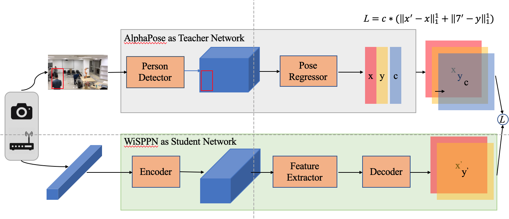

# Single Person Pose Estimation with WiFi

Download pre-trained model into [weights](https://drive.google.com/file/d/1VuEew_u5Nt49FVSwfNjQfVGOKazEVnVE/view?usp=sharing)

Run **test_pam.py**

## Network Framework

## An Example

