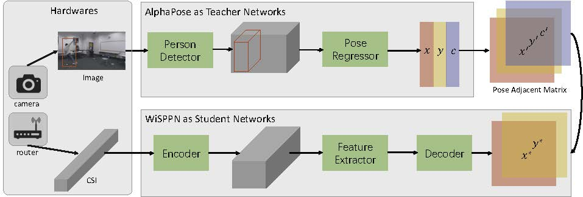
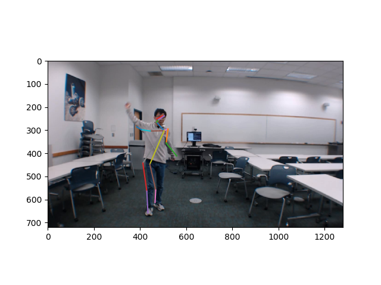

# Single Person Pose Estimation with WiFi

mkdir weights, and download the [pre-trained model](https://drive.google.com/file/d/1VuEew_u5Nt49FVSwfNjQfVGOKazEVnVE/view?usp=sharing)
 into weights
 
Run **test_pam.py**

## Network Framework

## An Example

## System Build 
Please find antennas and camera codes at [Person Perception](https://github.com/geekfeiw/wifiperson)

[CSI tool](https://github.com/spanev/linux-80211n-csitool) now supports Ubuntu 18.04.
